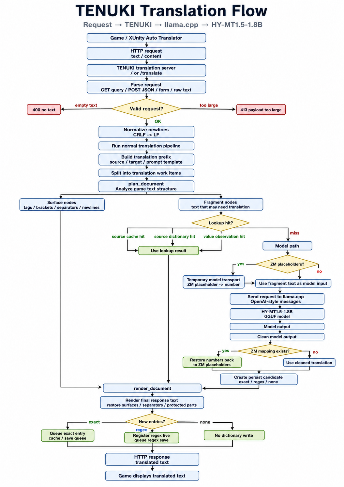
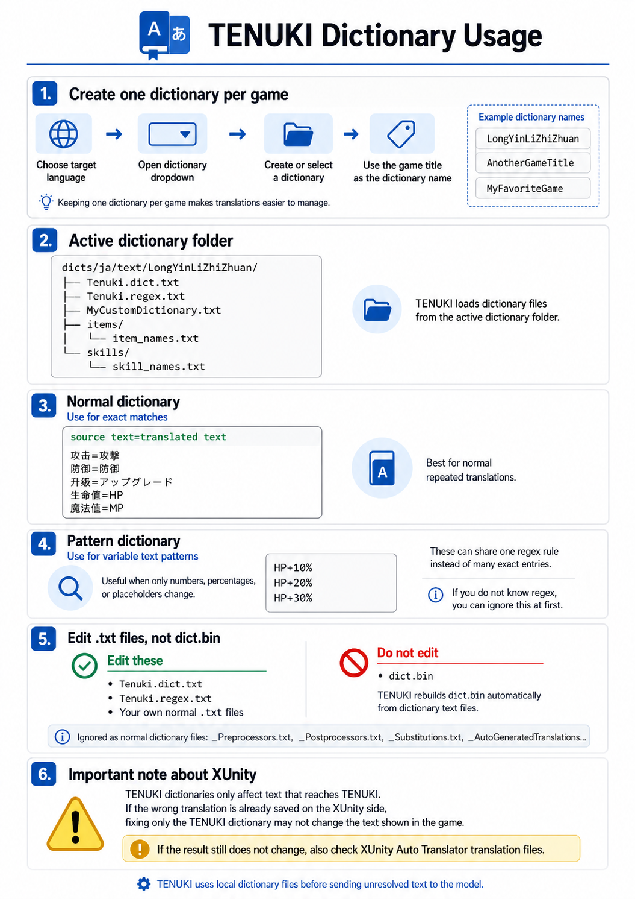

# TENUKI

TENUKI translates game text on the GPU using the HY-MT1.5 local LLM through llama.cpp and the XUnity Auto Translator endpoint.

## Contents

- [Quick Start](#quick-start)
- [XUnity Auto Translator Configuration](#xunity-auto-translator-configuration)
- [Translation Flow](#translation-flow)
- [Dictionary Usage](#dictionary-usage)

## Quick Start

### English

1. Download the latest release.
2. Run `TENUKI.exe`.  
   TENUKI will automatically download and set up `HY-MT2-1.8B-Q6_K.gguf` and the llama.cpp runtime that matches your backend.  
   Windows SmartScreen may show a warning.
3. When setup is finished, select the language you want to translate into. TENUKI will then automatically translate your game text.

### 日本語

1. 最新版をダウンロードします。
2. `TENUKI.exe` を起動します。  
   `HY-MT2-1.8B-Q6_K.gguf` と、バックエンドに合った llama.cpp runtime を自動でダウンロードしてセットアップします。  
   （Windows の SmartScreen が反応する場合があります。）
3. セットアップが終わったら、翻訳したい言語を選択します。以後、ゲームのテキストを自動で翻訳します。

### 简体中文

1. 下载最新版。
2. 运行 `TENUKI.exe`。  
   TENUKI 会自动下载并设置 `HY-MT2-1.8B-Q6_K.gguf` 以及适合当前后端的 llama.cpp runtime。  
   Windows SmartScreen 可能会显示警告。
3. 设置完成后，选择想要翻译成的语言。之后，TENUKI 会自动翻译游戏文本。

## XUnity Auto Translator Configuration

Configure XUnity Auto Translator to use TENUKI as a CustomTranslate endpoint.

```ini
[Service]
Endpoint=CustomTranslate
FallbackEndpoint=

[Behaviour]
TemplateAllNumberAway=True

[Custom]
Url=http://127.0.0.1:14371
EnableShortDelay=False
DisableSpamChecks=True
```

## Translation Flow

TENUKI receives translation requests from XUnity Auto Translator, checks the session cache and local dictionary, sends only unresolved text fragments to llama.cpp, restores protected game-text structures, and returns the final translated text to the game.



## Dictionary Usage

TENUKI can use local dictionary files before sending unresolved text to the model.  
Create one dictionary per game, use the game title as the dictionary name, and edit `.txt` dictionary files to improve translations.



### Create One Dictionary Per Game

Use the dictionary dropdown to create or select the active dictionary.

When you start translating a different game, create a new dictionary for that game.  
Using the game title as the dictionary name makes it easier to tell which dictionary belongs to which game.

Example dictionary names:

```text
LongYinLiZhiZhuan
AnotherGameTitle
MyFavoriteGame
```

Keeping one dictionary per game helps prevent translations from different games being mixed together.

### Where to Put Dictionary Files

Dictionary files are stored in the active dictionary folder.

Example:

```text
dicts/ja/text/LongYinLiZhiZhuan/
  Tenuki.dict.txt
  Tenuki.regex.txt
  MyCustomDictionary.txt
```

You can edit `Tenuki.dict.txt`, `Tenuki.regex.txt`, or place your own normal `.txt` dictionary files in the active dictionary folder.

TENUKI also loads normal `.txt` files inside first-level subfolders.

Example:

```text
dicts/ja/text/LongYinLiZhiZhuan/
  Tenuki.dict.txt
  Tenuki.regex.txt
  MyCustomDictionary.txt
  items/
    item_names.txt
  skills/
    skill_names.txt
```

TENUKI does not load XUnity special files as normal dictionary files, such as:

```text
_Preprocessors.txt
_Postprocessors.txt
_Substitutions.txt
_AutoGeneratedTranslations...
```

### Normal Dictionary

Use `Tenuki.dict.txt` or another normal `.txt` file for exact matches.

Format:

```text
source text=translated text
```

Example:

```text
攻击=攻撃
防御=防御
升级=アップグレード
生命值=HP
魔法值=MP
```

This is the easiest way to fix normal repeated translations.

### Pattern Dictionary

Use `Tenuki.regex.txt` for pattern rules.

This is useful when the same text changes only by numbers, percentages, or placeholders.

Example idea:

```text
HP+10%
HP+20%
HP+30%
```

These can share one pattern rule instead of many separate exact entries.

If you do not know regex, you can ignore `Tenuki.regex.txt` at first and use `Tenuki.dict.txt` or normal `.txt` dictionary files.

### Do Not Edit dict.bin

Do not edit `dict.bin`.

`dict.bin` is an automatic lookup index rebuilt by TENUKI from dictionary text files.  
Edit `Tenuki.dict.txt`, `Tenuki.regex.txt`, or your own `.txt` dictionary files instead.

### Important Note About XUnity

TENUKI dictionaries only affect text that reaches TENUKI.

XUnity Auto Translator can also keep its own saved translations.  
If a wrong translation is already saved on the XUnity side, fixing only the TENUKI dictionary may not change what appears in the game.

In that case, also check or clear the XUnity Auto Translator translation files.
